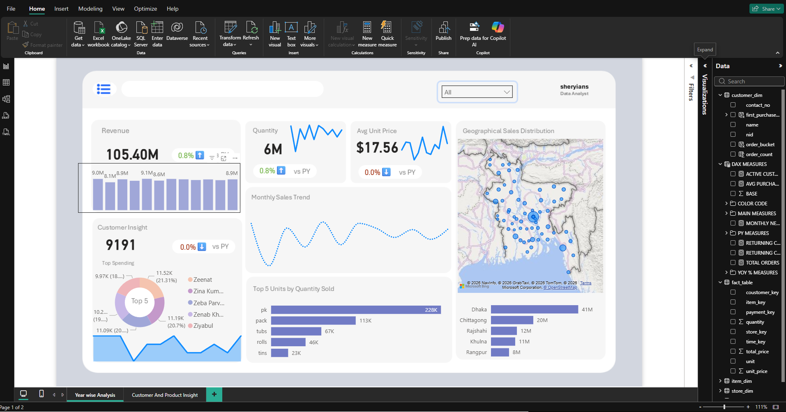
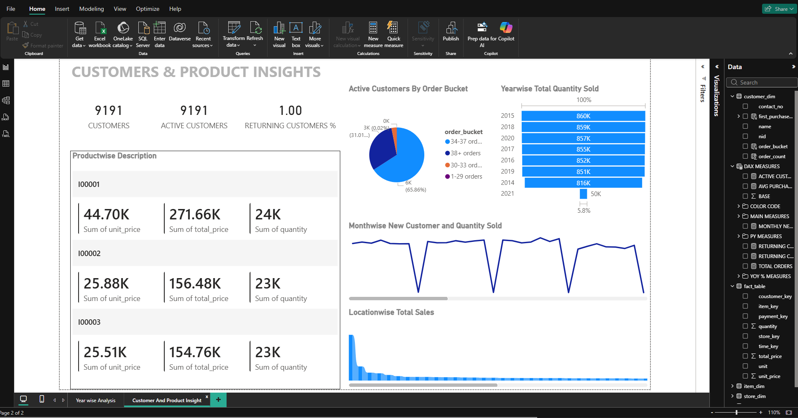

<h1 align="center">📊 E-Commerce Sales Analytics Dashboard</h1>

A complete Business Intelligence dashboard built using <b>Power BI, SQL, Python, Excel and DAX</b> to analyze customer behavior, product performance and sales trends.

<b>👨‍💻 Created by Kuldeep Rathore</b>

<h2>📂 Dataset Access</h2>

Due to the <b>large dataset size</b>, the complete dataset could not be uploaded to GitHub.
You can download it from the link below.

📥 <b>Download Dataset:</b> 
<a href="https://drive.google.com/drive/folders/1Vq2ScjRHSJ2uGcmbcGO_xQf8HFgD9Z8n?usp=sharing">
Click here to access the dataset
</a>

<h2>📊 Dashboard Preview</h2>

<h3>Sales Performance Overview</h3>

<h3>Customer & Product Insights</h3>

<h2>📌 Project Overview</h2>

This project presents an <b>interactive business intelligence dashboard</b> designed to analyze 
retail sales data and generate meaningful insights for decision making. The dashboard integrates 
data from multiple sources including <b>transactions, customers, items, stores, payments, and time dimensions</b>.

The main objective of this dashboard is to transform raw transactional data into 
<b>clear visual insights</b> that help businesses understand customer behavior, 
track product performance, and evaluate sales trends across different locations.

<h2>📈 Key Dashboard Insights</h2>

<ul>
<li><b>Total Revenue:</b> $105.40M</li>
<li><b>Total Quantity Sold:</b> 6 Million Units</li>
<li><b>Average Unit Price:</b> $17.56</li>
<li><b>Total Customers:</b> 9,191</li>
</ul>

The dashboard allows users to explore:

<ul>
<li>📊 Year-wise sales performance</li>
<li>📉 Monthly sales trends</li>
<li>👥 Customer purchase behavior</li>
<li>🏆 Top spending customers</li>
<li>📦 Product performance by quantity and revenue</li>
<li>🌍 Geographical sales distribution</li>
<li>📍 Location-wise revenue contribution</li>
</ul>

<h2>📊 Dashboard Features</h2>

<h3>1️⃣ Sales Overview</h3>

<ul>
<li>Total revenue generated</li>
<li>Total quantity sold</li>
<li>Average unit price</li>
<li>Monthly sales trends</li>
</ul>

<h3>2️⃣ Customer Insights</h3>

<ul>
<li>Total number of customers</li>
<li>Active and returning customers</li>
<li>Top 5 highest spending customers</li>
<li>Customer order frequency distribution</li>
</ul>

<h3>3️⃣ Product Analysis</h3>

<ul>
<li>Top selling products</li>
<li>Product quantity comparison</li>
<li>Product revenue contribution</li>
</ul>

<h3>4️⃣ Geographic Analysis</h3>

<ul>
<li>Interactive map showing sales locations</li>
<li>Location-wise revenue comparison</li>
</ul>

<h2>🧰 Tools & Technologies Used</h2>

<ul>
<li><b>MySQL</b> → Data storage and querying</li>
<li><b>Python</b> → Data preprocessing and transformation</li>
<li><b>Excel</b> → Initial data cleaning and formatting</li>
<li><b>Power BI</b> → Data visualization and dashboard development</li>
<li><b>DAX</b> → Calculated measures and KPIs</li>
</ul>

<h2>🗂 Project Structure</h2>

<pre>
dash
│
├── data
│
├── summary
│
├── dashboard
│
├── Image
│   ├── image-ecom-dashboard-1.png
│   └── image-ecom-dashboard-2.png
│
└── README.md
</pre>

<h2>📊 Data Model</h2>

The project follows a <b>star schema data model</b> with a central fact table connected to 
multiple dimension tables.

<b>Fact Table</b>

<ul>
<li>Sales transactions</li>
<li>Quantity</li>
<li>Unit price</li>
<li>Total price</li>
</ul>

<b>Dimension Tables</b>

<ul>
<li>Customer dimension</li>
<li>Item dimension</li>
<li>Store dimension</li>
<li>Time dimension</li>
<li>Payment dimension</li>
</ul>

<h2>🎯 Business Value</h2>

This dashboard helps businesses:

<ul>
<li>Identify high performing products</li>
<li>Understand customer purchasing behavior</li>
<li>Track sales growth over time</li>
<li>Detect high revenue locations</li>
<li>Make data-driven business decisions</li>
</ul>

<h2>👨‍💻 Author</h2>

<b>Kuldeep Rathore</b>

🔗 LinkedIn: 
<a href="https://www.linkedin.com/in/kuldeeprathore9440">
www.linkedin.com/in/kuldeeprathore9440
</a>

⭐ If you found this project useful, consider giving it a star!

